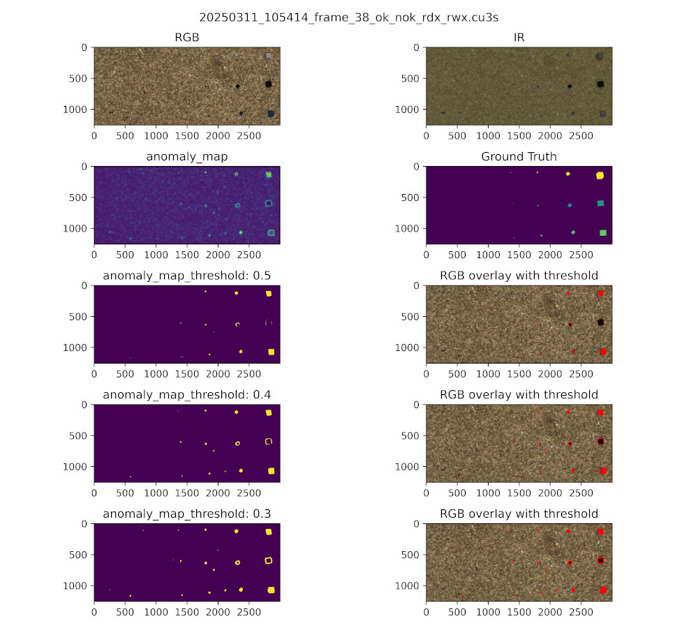

# Simple anomaly detection example

## Introduction

In this example, an anomaly detection model is trained outside cuvis.ai and inference is done using cuvis.ai.
Since cuvis.ai was not yet ready to train models with, it had to be done separately.

## The dataset

In our example dataset we used a custom-built camera assembly that creates six channel cubes. Three channels are from
a 24-megapixel RGB-camera and the other three are SWIR channels with 1050nm, 1200nm and 1450nm wavelength respectively.

The dataset is precisely built for unsupervised multispectral anomaly detection. It features 255 images,
which are divided into normal and anomalous images. We used sawdust in a wooden tray to create unique images on which
the model could lean. As anomalies, we used PLA, alcohol, leaves, a fake leaf, PET, POMC, transparent plastic
foil as well as water to demonstrate the capabilities of our SWIR setup.

The dataset and pretrained model weights can be
downloaded [here](https://drive.google.com/drive/folders/1bTNNSiFBQdPLgFlt3DHt06KmShmeTftj?usp=drive_link).

Notes on what the validation images show can be found in the ``dataset_notes.md``

## Model

We chose to go with the [EfficientAD](https://arxiv.org/pdf/2303.14535v3) model since it is an exciting,
state-of-the-art
model in anomaly detection.

As a base to build our implementation on, we used the EfficientAD code
of [Anomlaib](https://github.com/openvinotoolkit/anomalib). In order to make it work with more than three channels, the
input layers of the model, as well as the given teacher checkpoint, were adapted. The input layer of the model was
simply expanded to accept 6-channel images. The teacher weights and biases were duplicated and then divided by two to
get a 6-channel representation of the teacher. We halved the weights and biases of the teacher in order not to get the
same activation strength out of six channels as we would get out of three channels.

An ImageNet subset, which is used in training, can be
found [here](https://s3.amazonaws.com/fast-ai-imageclas/imagenette2.tgz). This dataset has to be adapted to six channels
in order to be used in our training loop. We did this
by duplicating the
three RGB channels to get a six-channel image.

## Prerequisite

This example is written using Python version 3.12 and cuvis SDK version 3.3.1, which can be
downloaded [here](https://cloud.cubert-gmbh.de/s/qpxkyWkycrmBK9m?path=%2FCuvis%203.3.1).

To get this example running, please install PyTorch with CUDA support from
their [website](https://pytorch.org/get-started/locally/). This example is tested for PyTorch version 2.6.0+cu124.

## How to train

After downloading the sample dataset and ImageNet dataset and extracting them into the data folder, the
``ImageNet_6ch_generator.py`` must be run. This will automatically create a six-channel version of ImageNet.

Now the train.py script can be run.

```
train.py -c example_train_config.yaml
```

The `example_train_config.yaml` has every parameter and path in it for the model and dataloader to work.
If you chose to alter the folder structure, you may need to change some paths in there before the training is able to
run.

## How to predict data using cuvis.ai

A detailed description of how to infer cubes using our trained model (or any other model in that regard) can be found in
the `inference.ipynb` notebook.

## How to create a report for the model and dataset

You can use the `report.py` in order to create a report of the model performance and generate a visual representation of
the outcome.
The script will create a folder at a specified location, infer the given datasets, and create a visually pleasing
output.

```
reporting.py -c example_report_config.yaml
```

## Results

With the given model weights and dataset, we reached a 0.93 image-AUROC and a 0.91 pixel-Auroc. Most of the anomalies
were detected correctly, only some were hardly detectable by the model.


Inference ROC over all classes present in our validation dataset.


Here we can see a detection result for an image with mixed PLA cubes ranging in size and color. We can see that the
bigger cubes are easily detected, while the smallest cubes (2mm) are only detected with higher thresholds. Also for
black PLA only the edges of the cube is detected as anomalous.

Both images were created by the `report.py` script.
