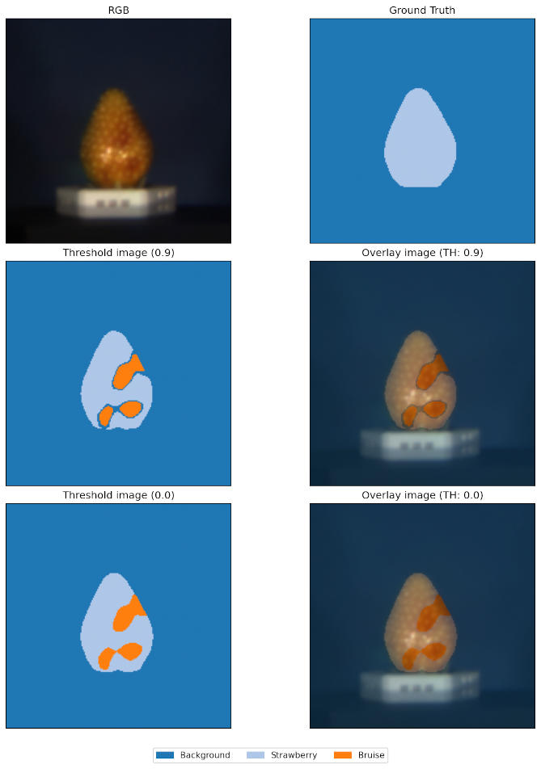
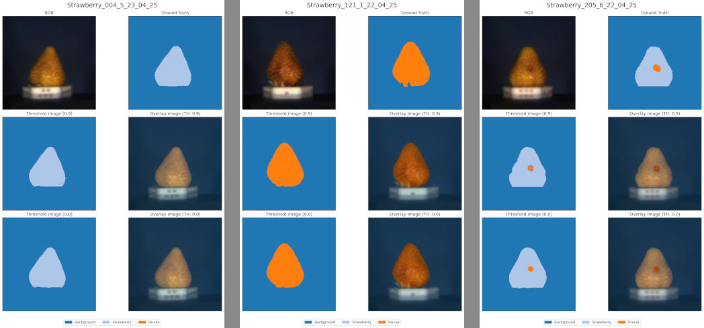

# Classifiction example

## Introduction

In this example, we used a UNet model to find bruised and unbruised areas in Strawberries.
Since cuvis.ai was not yet ready to train models with, it had to be done separately. But we provide a notebook which
walks you through how to load an externally trained deep neural network and use it to infer a datacube.

## The dataset

In our example dataset we used the cubert SWIR-1 camera which creates 38 channel cubes. They range from 900nm up to
1646nm.

The dataset is aimed at food inspection problems. Approximately 450 Strawberries were harvested on a farm near Ulm and
via human inspection the best 220 Strawberries were selected. We classified a strawberry as good if it had no visible
signs of bruising and the whole fruit showed a red color.
We then treated 100 strawberries with a vacuum sealer to apply uniform pressure to the whole fruit in order to have
completely bruised fruits.
Another 20 strawberries were treated with a steel ball rolling down an angled slope to hit the strawberry in the end.

All strawberries are placed on custom, 3D printed, hexagonal trays. The fruits are fixed in place and every side of the
tray has a number from 1 to 6 engraved in it.  
Therefore we can identify the side of the strawberry at any time and can compare the state of each strawberry side over
the five days of the data acquisition campaign.

All the SWIR images are labeled. These labels are to be taken with a little caveat: We used an RGB representation of
the data to label the data using Segment Anything and only fine-tuned the labels afterward. To simplify the labeling
process and decrease time spent, we assumed that all 100 non-treated fruits are completely bruise free and the 100
vacuum treated strawberries consist of only bruised material. This simplification leads to some errors in the ground
truth and therefore spikes in the loss of our model where it predicts bruising on "good" strawberries (and might even be
right about it).



This image showcases the problem and the power of SWIR imaging for food inspection. We could not detect any bruise on
this fruit in our manual inspection, but we can clearly see them in the RGB representation of our SWIR data cube. This
leads to "miss classification" by the model in areas where it is most likely right.

The last 20 strawberries of the dataset are the ones treated with the steel ball. They have also been labeled more
thoroughly using an early version of our model to try and find all bruises (not only the ones inflicted by us).
In the file ``dataset_notes.md`` you can find the notes on which of the bruises on these 20 fruits was inflicted using
the steel ball.

The dataset and pretrained model weights can be
downloaded [here](https://drive.google.com/drive/folders/1K8n2XCAPAHpOrFawpRMGSC-KRHSbTqbf?usp=sharing). The datacubes
are named by the following scheme: "Strawberry_NUMBER_SIDE_DATE.cu3s". The NUMBER refers to the number that was given to
the Strawberry (1-220), SIDE is the side of the strawberry which is visible in this image and the date is the day of
acquisition.

## Model

We chose to go with the [UNet](https://arxiv.org/pdf/1505.04597) model since it is a proven, simple and good
performing segmentation tool that is also applicable for hyperspectral data.

Our implementation consists of 4 stages consisting of convolution and pooling or upconvolution. We trained our model
with only three classes since the mold class is very underrepresented in our dataset and did not increase our
classification result. We therefore dropped the class and excluded the last day of data acquisition since it was the
only day when some strawberries were moldy.

## Prerequisite

This example is written using Python version 3.12 and cuvis SDK version 3.4.0, which can be
downloaded [here](https://cloud.cubert-gmbh.de/s/qpxkyWkycrmBK9m?path=%2FCuvis%203.4.0).

To get this example running, please install PyTorch with CUDA support from
their [website](https://pytorch.org/get-started/locally/). This example is tested for PyTorch version 2.6.0+cu124.

## How to train

After downloading the sample dataset and extracting it into the data folder, the train.py script can be run.

```
train.py -c example_train_config.yaml
```

The `example_train_config.yaml` has every parameter and path in it for the model and dataloader to work.
If you chose to alter the folder structure, you may need to change some paths in there before the training is able to
run.

> ⚠️ **Warning:** Increasing `num_workers` in the `example_train_config.yaml` can speed up data loading, but too many workers may cause excessive memory usage or even "out of memory" errors. Similarly, a larger `batch_size` improves throughput but also increases GPU/CPU memory demands.  
> If you encounter OOM errors or other CUDA stack traces, try reducing `batch_size` first, and/or lowering `num_workers` until the training runs stably. The default parameter set has been tested on an RTX 2060 with 8 GB of GPU memory.


## How to predict data using cuvis.ai

A detailed description of how to infer cubes using our trained model (or any other model in that regard) can be found in
the `inference.ipynb` notebook.

## How to create a report for the model and dataset

You can use the `Report` class to create a report of the model performance and generate a visual representation of
the outcome. An example usage is shown in `reporting.py`.
The script will create a folder at a specified location, infer the given datasets, and create a visually pleasing
output. Changing the folder, metrics or thresholds can be done in the ``example_report_config.yaml``. If the provided
metrics don't suffice you can also just add your own following our examples.

```
reporting.py -c example_report_config.yaml
```

## Results

With the given model weights and dataset, we reached a 0.995 Pixel-AUROC and a 0.988 Dice. The model has an easy time
differentiating between the background and the strawberries. In some cases it struggles with finding the bruises on an
otherwise good fruit. And on some Strawberries which are supposed to be either completely bruised or bruise free, the
model detects spots of unbruised or bruised strawberry respectively. This behaviour is somewhat expected, since we
cannot provide a 100% valid ground truth for all the strawberries.


Inference ROC for all 3 classes separately using a one vs rest approach.


Here we can see segmentation results for the three different cases present in out dataset. The first 100 strawberries
should all be completely bruise free and are labeled as such. Strawberries 101 through 200 are completely bruised
and the last 20 strawberries have a small bruise labeled. We can see these cases in this order from left to right.

All images were created by using the `Report` class.
